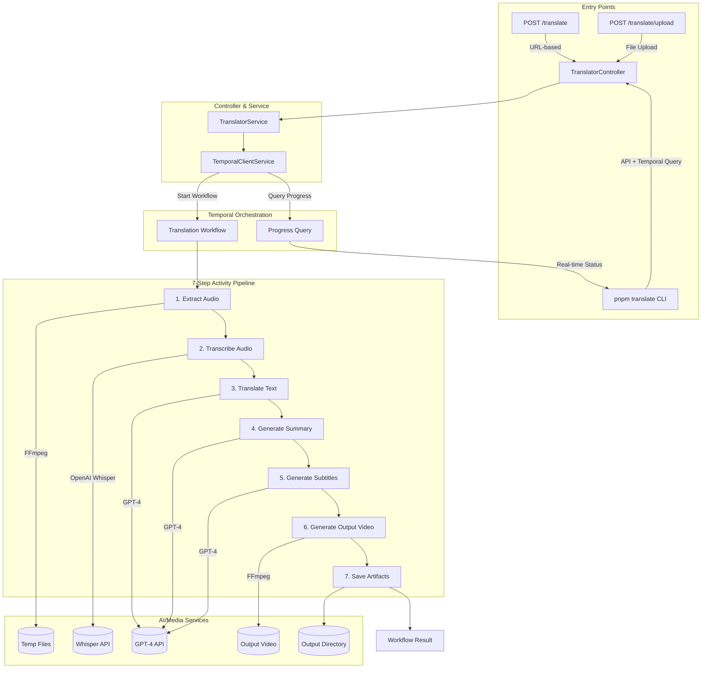

## Video Translator Workflow - Complete Pipeline Explanation

### High-Level Architecture



---

### Step-by-Step Activity Flow

#### **Step 1: Extract Audio** ([`extractAudio()`](video-translator/src/orchestrator/activities/translation.activities.ts:60))

**Input**: Video URL or local file path
**Output**: Local path to extracted MP3 audio file

```
┌─────────────────────────────────────────────────────────────┐
│                    Extract Audio Pipeline                   │
├─────────────────────────────────────────────────────────────┤
│ 1. Check if input is URL or local path                      │
│    └─> If URL: Download to /tmp/video-translator/           │
│                                                             │
│ 2. Detect file type by extension                            │
│    ├─> Video (.mp4, .mov, .avi, .mkv, .webm, .flv, .wmv)    │
│    │   └─> Run FFmpeg to extract audio                      │
│    └─> Audio (.mp3, .wav, .m4a, .ogg, .flac, .aac)          │
│        └─> Pass through directly                            │
│                                                             │
│ 3. FFmpeg conversion settings:                              │
│    • libmp3lame codec                                       │
│    • 192kbps bitrate                                        │
│    • 2 channels (stereo)                                    │
│    • 44.1kHz sample rate                                    │
└─────────────────────────────────────────────────────────────┘
```

#### **Step 2: Transcribe Audio** ([`transcribeAudio()`](video-translator/src/orchestrator/activities/translation.activities.ts:92))

**Input**: Local audio file path, source language hint
**Output**: `TranscriptionResult` with text, language, and time-stamped segments

```
┌─────────────────────────────────────────────────────────────┐
│                OpenAI Whisper Transcription                 │
├─────────────────────────────────────────────────────────────┤
│ API Call: openai.audio.transcriptions.create()              │
│                                                             │
│ Parameters:                                                 │
│  • model: "whisper-1"                                       │
│  • response_format: "verbose_json"                          │
│  • timestamp_granularities: ["segment"]                     │
│  • language: sourceLanguage (optional hint)                 │
│                                                             │
│ Returns:                                                    │
│  {                                                          │
│    text: "Full transcription text...",                      │
│    language: "en",                                          │
│    segments: [                                              │
│      { start: 0.0, end: 4.5, text: "First segment..." },    │
│      { start: 4.5, end: 9.2, text: "Second segment..." }    │
│    ]                                                        │
│  }                                                          │
└─────────────────────────────────────────────────────────────┘
```

#### **Step 3: Translate Text** ([`translateText()`](video-translator/src/orchestrator/activities/translation.activities.ts:131))

**Input**: Transcription text, source language, target language
**Output**: `TranslationResult` with original and translated text

```
┌─────────────────────────────────────────────────────────────┐
│                    GPT-4 Translation                        │
├─────────────────────────────────────────────────────────────┤
│ API Call: openai.chat.completions.create()                  │
│                                                             │
│ System Prompt:                                              │
│  "You are a professional translator. Translate from         │
│   {source} to {target}. Preserve meaning, tone, style.      │
│   Only output the translated text."                         │
│                                                             │
│ Parameters:                                                 │
│  • model: "gpt-4-turbo-preview"                             │
│  • temperature: 0.3 (more deterministic)                    │
│                                                             │
│ Returns:                                                    │
│  {                                                          │
│    originalText: "Hello world...",                          │
│    translatedText: "Hola mundo...",                         │
│    sourceLanguage: "en",                                    │
│    targetLanguage: "es"                                     │
│  }                                                          │
└─────────────────────────────────────────────────────────────┘
```

#### **Step 4: Generate Summary** ([`generateSummary()`](video-translator/src/orchestrator/activities/translation.activities.ts:169))

**Input**: Translated text, target language
**Output**: `SummaryResult` with summary and key points

```
┌─────────────────────────────────────────────────────────────┐
│                  GPT-4 Summarization                        │
├─────────────────────────────────────────────────────────────┤
│ API Call: openai.chat.completions.create()                  │
│                                                             │
│ System Prompt:                                              │
│  "Create a concise summary in {targetLanguage}.             │
│   Extract 3-5 key points.                                   │
│   Format as JSON: {summary, keyPoints[]}"                   │
│                                                             │
│ Parameters:                                                 │
│  • model: "gpt-4-turbo-preview"                             │
│  • temperature: 0.5                                         │
│  • response_format: { type: "json_object" }                 │
│                                                             │
│ Returns:                                                    │
│  {                                                          │
│    summary: "Este video trata sobre...",                    │
│    keyPoints: ["Punto 1", "Punto 2", "Punto 3"],            │
│    language: "es"                                           │
│  }                                                          │
└─────────────────────────────────────────────────────────────┘
```

#### **Step 5: Generate Subtitles** ([`generateSubtitles()`](video-translator/src/orchestrator/activities/translation.activities.ts:214))

**Input**: Original segments with timestamps, full translated text
**Output**: SRT or VTT formatted subtitle content

```
┌─────────────────────────────────────────────────────────────┐
│                 GPT-4 Subtitle Generation                   │
├─────────────────────────────────────────────────────────────┤
│ 1. Take original segments with timings from Whisper         │
│                                                             │
│ 2. Use GPT-4 to align translated text with timings:         │
│    "Distribute translated text across segments              │
│     maintaining original timing structure"                  │
│                                                             │
│ 3. Generate SRT format:                                     │
│    1                                                        │
│    00:00:00,000 --> 00:00:04,500                            │
│    Hola, bienvenido al tutorial                             │
│                                                             │
│    2                                                        │
│    00:00:04,500 --> 00:00:09,200                            │
│    Hoy aprenderemos sobre...                                │
│                                                             │
│ 4. Or VTT format:                                           │
│    WEBVTT                                                   │
│                                                             │
│    00:00:00.000 --> 00:00:04.500                            │
│    Hola, bienvenido al tutorial                             │
└─────────────────────────────────────────────────────────────┘
```

#### **Step 6: Generate Output Video** ([`generateOutputVideo()`](video-translator/src/orchestrator/activities/translation.activities.ts:316))

**Input**: Original video path, SRT subtitle file path, hardcode option
**Output**: `GenerateOutputVideoResult` with output video path

```
┌────────────────────────────────────────────────────────────────┐
│                 FFmpeg Video Generation                        │
├────────────────────────────────────────────────────────────────┤
│ 1. Determine subtitle mode from outputOptions                  │
│                                                                │
│ 2. Softcoded (default):                                        │
│    • Add subtitle track as separate stream                     │
│    • Video/audio copied without re-encoding                    │
│    • User can toggle subtitles on/off                          │
│    • ffmpeg -i video.mp4 -i subtitles.srt                      │
│             -c:v copy -c:a copy -c:s mov_text output.mp4       │
│                                                                │
│ 3. Hardcoded (burn-in):                                        │
│    • Subtitles rendered directly into video pixels             │
│    • Video re-encoded (slower but always visible)              │
│    • ffmpeg -i video.mp4 -vf "subtitles=subtitles.srt"         │
│             -c:a copy output.mp4                               │
│                                                                │
│ Returns:                                                       │
│  {                                                             │
│    outputPath: "/output/translation-xxx/translated_video.mp4", │
│    format: "mp4",                                              │
│    subtitleType: "softcoded" | "hardcoded"                     │
│  }                                                             │
└────────────────────────────────────────────────────────────────┘
```

#### **Step 7: Save Artifacts** ([`saveWorkflowArtifacts()`](video-translator/src/orchestrator/activities/translation.activities.ts:347))

**Input**: All workflow results (transcription, translation, summary, subtitles, etc.)
**Output**: `SaveArtifactsResult` with artifacts directory path

```
┌──────────────────────────────────────────────────────────────────┐
│                   Save Workflow Artifacts                        │
├──────────────────────────────────────────────────────────────────┤
│ Creates output directory: /output/video-translator/{workflowId}/ │
│                                                                  │
│ Saved files:                                                     │
│  • subtitles.srt     - SRT subtitle file                         │
│  • subtitles.vtt     - VTT subtitle file                         │
│  • transcription.txt - Original transcription text               │
│  • translation.txt   - Translated text                           │
│  • metadata.json     - Full workflow metadata:                   │
│    {                                                             │
│      workflowId: "translation-xxx",                              │
│      sourceLanguage: "en",                                       │
│      targetLanguage: "es",                                       │
│      transcription: "...",                                       │
│      translation: "...",                                         │
│      summary: "...",                                             │
│      keyPoints: [...],                                           │
│      outputVideoPath: "...",                                     │
│      createdAt: "2024-01-29T12:00:00.000Z"                       │
│    }                                                             │
│                                                                  │
│ Returns:                                                         │
│  {                                                               │
│    artifactsDir: "/output/video-translator/translation-xxx",     │
│    files: ["subtitles.srt", "subtitles.vtt", ...]                │
│  }                                                               │
└──────────────────────────────────────────────────────────────────┘
```

---

### Progress Query

The workflow exposes a **Temporal Query** for real-time progress tracking:

```typescript
// In workflow
export const getProgressQuery = defineQuery<WorkflowProgress>("getProgress")

// Query response
interface WorkflowProgress {
  currentStep: number // 1-7
  totalSteps: number // 7
  stepName: string // "Generating subtitles"
  percentComplete: number // 0-100
  status: "running" | "completed" | "failed"
  error?: string
}
```

**Progress percentages:**
| Step | Name | Percent |
|------|------|---------|
| 1 | Extract Audio | 5% |
| 2 | Transcribe | 20% |
| 3 | Translate | 40% |
| 4 | Summary | 55% |
| 5 | Subtitles | 70% |
| 6 | Video Output | 85% |
| 7 | Save Artifacts | 95% → 100% |

---

### Final Workflow Result

```typescript
{
  success: true,
  transcription: "Original English transcription...",
  translation: "Translated Spanish text...",
  summary: "Resumen del video...",
  keyPoints: ["Punto 1", "Punto 2", "Punto 3"],
  subtitlesPath: "/output/video-translator/translation-xxx/subtitles.srt",
  outputVideoPath: "/output/video-translator/translation-xxx/translated_video.mp4",
  artifactsDir: "/output/video-translator/translation-xxx",
  processingTimeMs: 45000
}
```

---

### Temporal Benefits

1. **Durability**: Each activity is checkpointed - if the server crashes mid-workflow, it resumes from the last completed activity
2. **Retry Logic**: Each activity has `maximumAttempts: 3` with automatic retries on failure
3. **Timeout Protection**: `startToCloseTimeout: 10 minutes` per activity
4. **Visibility**: Monitor workflow progress in Temporal UI at `http://localhost:8089`
5. **Progress Queries**: Real-time progress tracking via `defineQuery('getProgress')`
6. **History**: Full execution history preserved for debugging
